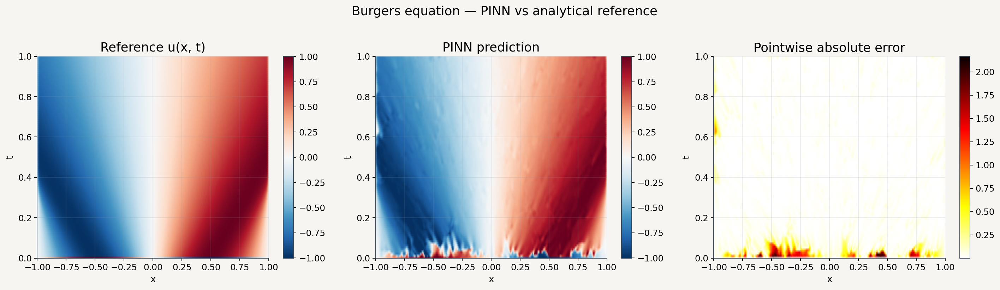

# Physics-Informed Neural Network for the 1-D Burgers Equation

Clean, reproducible PyTorch implementation of a Physics-Informed Neural Network (PINN) for the viscous 1-D Burgers equation. The repository is structured as a small research codebase rather than a one-off notebook: packaged source code, a CLI, tests, CI, and example artifacts are all included.



## Problem

The model solves

$$
u_t + u u_x = \nu u_{xx}, \quad x \in [-1, 1], \ t \in [0, 1]
$$

with:

- Initial condition: $u(x, 0) = -\sin(\pi x)$
- Boundary conditions: $u(-1, t) = u(1, t) = 0$
- Default viscosity: $\nu = 0.01 / \pi$

The reference solution is generated analytically with the Cole-Hopf transform and used both for sparse observations and evaluation.

## What Is In The Repo

- `src/physical_informed_neural_network/`: core implementation
- `src/physics_informed_neural_network/`: public package namespace and CLI
- `tests/`: fast automated checks, including an end-to-end smoke test
- `artifacts/burgers_pinn/`: example outputs from a reference run
- `notebooks/burgers_equation_pinn.ipynb`: generated exploratory notebook
- `.github/workflows/ci.yml`: GitHub Actions workflow for install + test + notebook generation

## Method

- Random Fourier features for coordinate encoding
- Residual MLP blocks for the backbone
- Multi-term PINN loss with PDE, boundary, initial-condition, and data supervision
- Adam training with optional LR scheduling, followed by L-BFGS refinement
- Latin Hypercube sampling for collocation points
- Pydantic-validated configuration objects for experiment settings

## Installation

```bash
python -m venv .venv
source .venv/bin/activate
python -m pip install --upgrade pip
python -m pip install -e ".[dev]"
```

## Quick Start

Run a fast smoke test:

```bash
burgers-pinn --smoke-test
```

Run the default experiment:

```bash
burgers-pinn
```

You can also use the repository entry point without installation:

```bash
python main.py --smoke-test
```

Useful flags:

```bash
burgers-pinn --smoke-test --no-artifacts --json
burgers-pinn --device cpu --adam-epochs 5000 --lbfgs-iterations 300
burgers-pinn --output-dir artifacts/custom_run
```

## Testing

```bash
pytest -q
```

The test suite includes:

- configuration validation
- reference-solution and sampler shape checks
- an end-to-end smoke run of the training pipeline

## Example Outputs

The repository includes a sample run in `artifacts/burgers_pinn/`:

- `comparison.png`: analytical solution vs PINN prediction
- `time_slices.png`: selected temporal slices
- `pointwise_error.png`: absolute error heatmap
- `loss_history.png`: training curves
- `summary.json`: experiment metadata and metrics

## Notebook

The notebook is generated from `tools/generate_notebook.py` so that the narrative view stays consistent with the package code:

```bash
python tools/generate_notebook.py
```

## Shareability Checklist

This project is reasonable to publish on GitHub now because it has:

- real source code instead of only a notebook
- a documented installation and execution path
- a smoke-test mode for quick verification
- automated tests and a CI workflow
- a license
- included sample outputs

## References

1. Raissi, M., Perdikaris, P., and Karniadakis, G. E. (2019). Physics-informed neural networks. *Journal of Computational Physics*, 378, 686-707.
2. Tancik, M., et al. (2020). Fourier features let networks learn high frequency functions in low dimensional domains. *NeurIPS*.
3. Wang, S., Teng, Y., and Perdikaris, P. (2021). Understanding and mitigating gradient flow pathologies in physics-informed neural networks. *SIAM Journal on Scientific Computing*.

## License

MIT. See [LICENSE](LICENSE).
